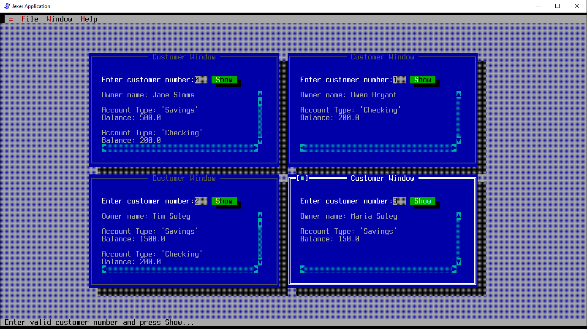

# UI Lab 1

## На "п'ять"

1. Перепишіть метод ShowCustomerDetails з використанням класів Bank, Customer, Account та ін. з наших попередніх лаб - інформація про клієнтів банку та їх рахунках має читатись з    файлу test.dat (робота номер 8, файл даних також є в цьому ж репозиторію). Інформацію про клієнта (та про перший рахунок, що йому належить) ви маєте побачити, увівши номер клієнта.
2. Запустіть проект, впевніться, що все працює як очікувалось. Продемонстрируйте результат викладачеві.
  
## Результат

